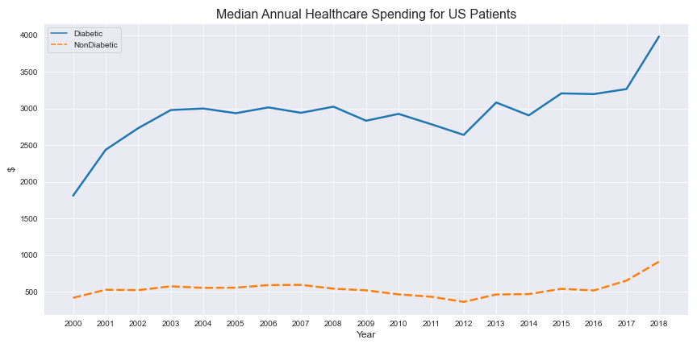
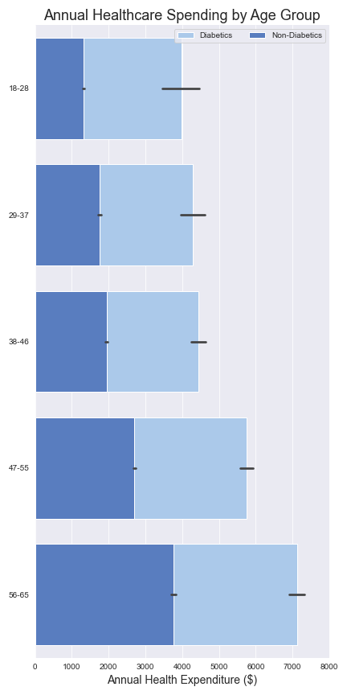

# The Relationship Between Healthcare Spending & Diabetes (US)

By: [Dom Garcia](mailto:dlgarcia.017@gmail.com)

# Overview

In this project, a combination of exploratory data analysis, regression modeling & classification modeling is used to determine whether the factors that determine healthcare expenses are the same for diabetics & non-diabetics. My conclusions on this question are then used to make actionable recommendations to the non-profit organization Beyond Type I. Additionally, this project seeks to provide a statistical answer on whether healthcare spending is similar between the two groups. 

# Business Problem

[Beyond Type I](https://beyondtype1.org/) is a nonprofit with a focus on education, advocacy & a path to cure Type I Diabetes. A primary focus of their advocacy is the added cost of living for those diagnosed with the condition.

Recently, they’ve aimed to put together a comprehensive report on the factors that determine how much income diabetic & non-diabetic citizens spend on healthcare. As part of the team working on the report, my task is to use regression modeling to answer the following question:

**Are the demographic factors (race, sex, education level, income level, age) most important to determining money spent on healthcare the same for diabetics & non-diabetics?**

# Data

Data in this project is sourced from the Medical Expenditure Panel Survey (MEPS), a nationally representative survey of the civilian noninstitutionalized population administered by the Agency for Healthcare Research and Quality. Specifically, this project's data is pulled from MEPS's annual [Household Full Year Consolidated Data Files](https://www.meps.ahrq.gov/mepsweb/data_stats/download_data_files_results.jsp?cboDataYear=All&cboDataTypeY=1%2CHousehold+Full+Year+File&buttonYearandDataType=Search&cboPufNumber=All&SearchTitle=Consolidated+Data).

The initial list of columns to keep for each dataset was determined by reading through the codebook provided for each year's Household Full Year Consolidated Data File. Using the codebooks, I was able to determine which columns contained the relevant demographic, socieocomonic & healthcare expenditure data for this task. Additionally, I was able to determine which of these columns were common across all (or most) years 2000 - 2018, and which were not. 

For reference, the codebook from 2018 is provided [here](https://www.meps.ahrq.gov/data_stats/download_data/pufs/h209/h209cb.pdf).

# Process

This project begins with a lengthy inspection, adjustment & standardization of column values across all 19 years (2000-2018). After this preprocessing phase, I perform exploratory data analysis (EDA) & construct visualizations for the columns in my dataset. This provides some valuable insight into relationships between certain demographic factors & healthcare spending for both diabetic and non-diabetic survey subjects. 

After the processing, EDA & visualizing, I move on to iterative modeling. For all but one of the algorithms in this section, 3 separate models are constructed:

* *General*: Includes data on both diabetics & non-diabetics. This model's purpose is to let me know how important having diabetes is in determining which healthcare expenditure tier a subject is part of.

* *Diabetics*: Only includes data on diabetic survey subjects. This model's purpose is to let me know which demographic features are most important in determining which healthcare expenditure tier a diabetic subject is part of.

* *Non-Diabetics*: Only includes data on non-diabetic survey subjects. This model's purpose is to let me know which demographic features are most important in determining which healthcare expenditure tier a non-diabetic subject is part of.

I begin by performing regression tasks, with the demographic data as the input features & the logarithm of annual healthcare spending as the target. Regression begins with a baseline decision tree, to which I can compare the performance of subsequent regressors.

After evaulating the performance of these regressors, however, it becomes apparent that none of them are reliable enough predictors to draw conclusions from. All of them are prone to drastic overfitting, and those that don't overfit are unable to return satisfactory R-squared values. 

Subsequently, I re-orient my modeling goal from regression to classification, turning the original healthcare spending target into a categorical target consisting of spending tiers (based on quartile values). To begin this section, I run a naive dummy classifier that makes guesses based on class distribution. 

Ultimately, my best results come from using multionimial logistic regression (MLR) to classify the healthcare spending tier. The MLR models exhibit the best fitting from training to test data, and consistently have accuracy scores from 35-50%. At the very least, these metrics are a significant improvment over the naive classifier. 

# Results

One of the most insightful plots from the EDA & Visualization section is a lineplot of annual median healthcare expenditures for both diabetics & non-diabetics. Based on this plot, the gap in median healthcare expenditures between the two groups seems to have increased by 1,677.50 USD from 2000 to 2018. 

Another highlight of the section is a comparison of age vs. healthcare spending for both groups of interest.

For both groups, healthcare spending seems to increase as a person ages. For diabetics, though, the increase in spending becomes more significant – especially for ages 38-46 and beyond (compare differences between light blue boxes to differences between dark blue boxes).

Ultimately, these are the conclusions drawn from the most effective models:

* *General*: **whether subject has diabetes is the 3rd most important feature** in determining degree of healthcare spending

* *Diabetics*: demographic features that are significant in predicting degree of healthcare spending -- subject's **age**

* *Non-Diabetics*: demographic features that are significant in predicting degree of healthcare spending -- subject's **age**, **sex**, **income**

Finally, to address the initial problem's main question: the most impactful factor on healthcare spending for both groups is a person's age. As seen in EDA & visualization, though, healthcare spending increases more rapidly over time for diabetics. 

# Recommendations

Based on this conclusion, I recommend that Beyond Type I:

* Direct fundraising efforts toward poorer middle-age diabetics, whose income might not keep up with rising healthcare costs over time.
* Make an organization-wide push to recruit more middle-age diabetics into their advocacy efforts. 
* Create education programs for older citizens that ensure they maintain healthy habits & keep them up to date on the latest diabetes management technology.

# Future Work

Given more time with the job, I would:

* Obtain similar data that has a more thorough time component in order to perform time series based speculation about future healthcare costs.
* Obtain healthcare spending data for US residents with other specific conditions to observe how much they spend compared to diabetics. 
* Make comparison of diabetes healthcare costs for US residents vs residents of other nations around the world.

# For More Information

See the full analysis in the [Jupyter Notebook](https://github.com/dl-gd/flatiron-capstone/blog/master/diabetes.expenses.ipynb), or check out this [presentation](https://github.com/dl-gd/flatiron-capstone/blog/master/NonTechnical_Capstone.pdf).

For additional info, contact Dom Garcia at [dlgarcia.017@gmail.com](mailto:dlgarcia.017@gmail.com)
